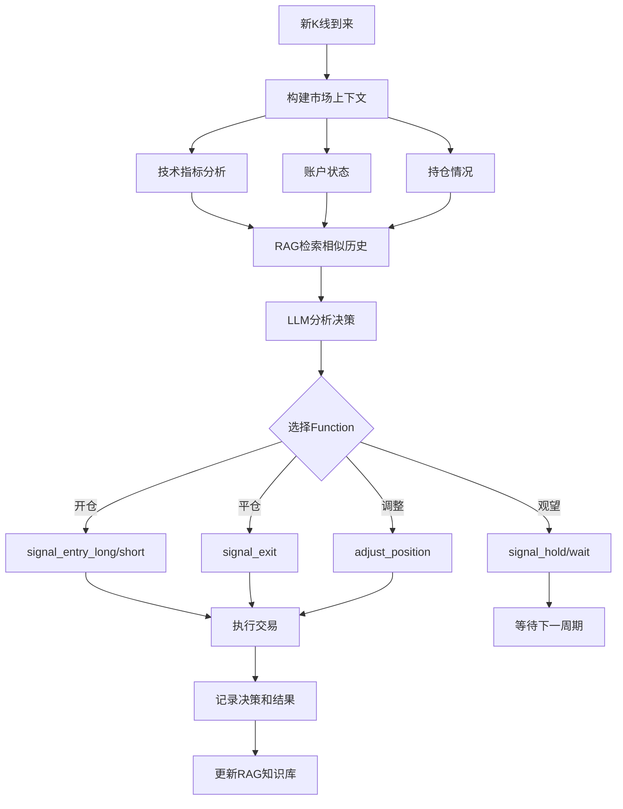

# Freqtrade LLM Function Calling Strategy

> 基于大语言模型（LLM）Function Calling 和 RAG 技术的智能加密货币交易策略

[](https://www.freqtrade.io/)
[](https://www.python.org/)
[](LICENSE)

---

## 🔐 重要安全提示

**在使用本项目前，请务必配置您的敏感信息！**

本代码库中的配置文件（`user_data/config.json`）已经过脱敏处理，所有 API 密钥、交易所密钥等敏感信息均已清空。在运行项目前，您需要：

1. **填写您的 LLM API 密钥**：在 `user_data/config.json` 的 `llm_config` 部分
2. **填写交易所 API 密钥**：在 `user_data/config.json` 的 `exchange` 部分
3. **配置其他服务**：Telegram、Discord、JWT 等（可选）

详细配置说明请参考：[CONFIG_TEMPLATE.md](CONFIG_TEMPLATE.md)

**安全建议**：
- ✅ 使用环境变量存储敏感信息（参考 `.env.example`）
- ✅ 不要将包含真实密钥的配置文件提交到版本控制
- ✅ 建议先使用 `dry_run: true` 模式测试
- ✅ 限制交易所 API 权限（不开启提现权限）

---

## 📋 目录

- [🔐 重要安全提示](#-重要安全提示)
- [🎯 项目简介](#-项目简介)
- [✨ 核心特性](#-核心特性)
- [🏗️ 系统架构](#️-系统架构)
- [🚀 快速开始](#-快速开始)
- [💡 常见使用场景](#-常见使用场景)
- [⚙️ 配置说明](#️-配置说明)
- [📖 使用指南](#-使用指南)
- [📊 性能监控](#-性能监控)
- [🔧 故障排除](#-故障排除)
- [🔬 技术细节](#-技术细节)
- [⚠️ 风险提示](#️-风险提示)

---

## 🎯 项目简介

这是一个创新的加密货币自动化交易策略，将 **Freqtrade** 交易框架与 **大语言模型（LLM）** 深度整合，通过 OpenAI Function Calling 和 RAG（检索增强生成）技术实现智能交易决策。

### 为什么选择 LLM 策略？

- **🧠 智能决策**: LLM 可以理解复杂的市场情况，提供类人的交易判断
- **📚 经验学习**: RAG 系统从历史交易中学习，不断优化决策质量
- **🎯 精准控制**: Function Calling 提供 6 个核心交易函数，实现精细化交易管理
- **📊 多维度分析**: 综合技术指标、账户状态、持仓情况进行全局决策

---

## ✨ 核心特性

### 1. **OpenAI Function Calling 完整交易控制**

LLM 通过 6 个核心函数完全控制交易流程：

| 函数名称 | 功能描述 | 主要参数 |
|---------|---------|---------|
| `signal_entry_long` | 开多仓 | 挂单价、杠杆、止损、置信度、关键位 |
| `signal_entry_short` | 开空仓 | 挂单价、杠杆、止损、置信度、关键位 |
| `signal_exit` | 平仓 | 挂单价、置信度、RSI |
| `adjust_position` | 加仓/减仓 | 调整百分比、挂单价、关键位 |
| `signal_hold` | 保持持仓 | 置信度、理由 |
| `signal_wait` | 空仓观望 | 置信度、理由 |

### 2. **RAG 语义检索系统**

- **向量数据库**: ChromaDB
- **嵌入模型**: text-embedding-bge-m3
- **功能**:
  - 检索相似的历史交易情况
  - 从过往成功/失败案例中学习
  - 提供上下文相关的交易建议

### 3. **期货交易完整支持**

- ✅ 多空双向交易（做多/做空）
- ✅ 动态杠杆（1-100x，由 LLM 决定）
- ✅ 动态止损（基于账户百分比）
- ✅ 仓位调整（加仓/减仓）
- ✅ 挂单价格控制（入场/出场精确定价）

### 4. **多时间框架技术分析**

支持 4 个时间框架同时分析：
- **15分钟**（主时间框架）
- **1小时**
- **4小时**
- **日线**

技术指标包括：
- 趋势：EMA(20/50/200)
- 动量：RSI、MACD
- 波动：布林带、ATR
- 强度：ADX、MFI、OBV

### 5. **经验学习与决策记录**

- 📝 每笔交易决策自动记录
- 🔍 包含市场上下文、技术指标、推理过程
- 📊 支持事后分析和策略优化
- 🎓 RAG 系统持续从历史中学习

---

## 🏗️ 系统架构

```
ft-userdata-llm/
├── docker-compose.yml          # Docker 编排配置
├── Dockerfile.custom           # 自定义镜像（安装 ChromaDB）
├── manage.sh                   # 一键管理脚本
│
└── user_data/
    ├── config.json             # 核心配置文件
    │
    ├── strategies/
    │   ├── LLMFunctionStrategy.py    # 主策略文件
    │   │
    │   └── llm_modules/              # LLM 模块
    │       ├── llm/                  # LLM 客户端
    │       │   ├── llm_client.py         # OpenAI API 封装
    │       │   └── function_executor.py  # Function Calling 执行器
    │       │
    │       ├── rag/                  # RAG 系统
    │       │   ├── embedding_service.py  # 嵌入服务
    │       │   ├── vector_store.py       # ChromaDB 封装
    │       │   └── rag_manager.py        # RAG 管理器
    │       │
    │       ├── tools/                # 交易工具
    │       │   └── trading_tools.py      # 6个核心交易函数
    │       │
    │       ├── experience/           # 经验系统
    │       │   ├── trade_logger.py       # 交易日志
    │       │   └── experience_manager.py # 经验管理
    │       │
    │       └── utils/                # 工具类
    │           ├── config_loader.py      # 配置加载
    │           └── context_builder.py    # 上下文构建
    │
    ├── data/
    │   └── vector_store/         # ChromaDB 向量数据库
    │
    └── logs/
        ├── freqtrade.log         # 主日志
        ├── llm_decisions.jsonl   # LLM 决策日志
        └── trade_experience.jsonl # 交易经验日志
```

---

## 🚀 快速开始

### 前置要求

- **Docker** 和 **Docker Compose** 已安装
- **LLM API**: 支持 OpenAI Function Calling 的 API（如 OpenAI、OneAPI、本地 LLM）
- **币安账户**（或其他支持的交易所）

### 1. 配置 LLM API

编辑 `user_data/config.json`：

```json
"llm_config": {
    "api_base": "http://host.docker.internal:3120",
    "api_key": "your-api-key",
    "model": "qwen/qwen3-coder-30b",
    "embedding_model": "text-embedding-bge-m3",
    "temperature": 0.7,
    "max_tokens": 2000,
    "timeout": 60
}
```

**支持的 LLM 提供商**:
- OpenAI GPT-4
- OneAPI (兼容 OpenAI 格式)
- Qwen3 Coder
- DeepSeek
- 其他兼容 OpenAI Function Calling 的模型

### 2. 配置交易所

编辑 `user_data/config.json` 中的交易所配置：

```json
"exchange": {
    "name": "binance",
    "key": "your-api-key",
    "secret": "your-api-secret",
    "ccxt_config": {
        "enableRateLimit": true,
        "options": {
            "defaultType": "future"
        }
    }
}
```

### 3. 启动策略

#### 方式一：使用管理脚本（推荐）

**一键管理脚本 `manage.sh` 提供完整的生命周期管理**

```bash
# 首次使用：赋予执行权限
chmod +x manage.sh

# 命令行模式（快速操作）
./manage.sh start    # 快速启动 ⚡（推荐日常使用）
./manage.sh logs     # 查看实时日志
./manage.sh restart  # 重启服务
./manage.sh stop     # 停止服务
./manage.sh deploy   # 完整部署（检查更新+重新构建）
./manage.sh clean    # 清理所有数据（谨慎使用）

# 交互式菜单模式
./manage.sh          # 不带参数，显示交互式菜单
```

**manage.sh 功能详解**:

| 命令 | 说明 | 使用场景 |
|------|------|---------|
| `start` | 快速启动 + 自动查看日志 | ⚡ 日常启动（最常用） |
| `restart` | 重启容器 + 查看日志 | 修改配置后重启 |
| `deploy` | 检查版本 + 构建镜像 + 启动 | 首次部署或大版本更新 |
| `logs` | 只查看实时日志 | 监控运行状态 |
| `stop` | 停止服务 | 暂停交易 |
| `clean` | 清理所有数据 | 重置系统（会删除历史数据） |

**交互式菜单（运行 `./manage.sh`）**:
```
  Freqtrade LLM Strategy 管理工具
=================================================

  1) 快速启动 (直接启动 + 查看日志) ⚡
  2) 快速重启 (重启容器 + 查看日志)
  3) 完整部署 (检查版本 + 构建 + 启动)
  4) 只查看日志
  5) 清理所有数据
  6) 检查版本
  7) 停止服务
  0) 退出
```

#### 方式二：直接使用 Docker Compose

```bash
# 构建镜像（首次或更新时）
docker-compose build

# 启动服务
docker-compose up -d

# 查看日志
docker logs -f freqtrade-llm

# 停止服务
docker-compose down

# 重启服务
docker-compose restart
```

#### 首次启动流程示例

```bash
# 1. 克隆项目
git clone https://github.com/your-username/freqtrade-llm-strategy.git
cd freqtrade-llm-strategy

# 2. 配置 API 密钥（重要！）
nano user_data/config.json  # 填写 llm_config 和 exchange 配置

# 3. 赋予脚本执行权限
chmod +x manage.sh

# 4. 首次部署（会自动构建镜像）
./manage.sh deploy

# 5. 观察日志，确认运行正常
# 按 Ctrl+C 退出日志查看
```

#### 日常使用流程

```bash
# 每天启动
./manage.sh start

# 修改配置后重启
nano user_data/config.json
./manage.sh restart

# 查看运行状态
./manage.sh logs
```

### 4. 监控运行

- **日志**: `./manage.sh logs` 或 `docker logs -f freqtrade-llm`
- **Web UI**: http://localhost:8086 (用户名密码见 `config.json`)
- **REST API**: http://localhost:8086/api/v1/

---

## 💡 常见使用场景

### 场景 1：首次使用（模拟交易测试）

```bash
# 1. 配置文件中确保开启模拟模式
# user_data/config.json 中设置：
#   "dry_run": true,
#   "dry_run_wallet": 1340

# 2. 启动系统
./manage.sh deploy

# 3. 观察 LLM 决策日志
tail -f user_data/logs/llm_decisions.jsonl | jq .

# 4. 查看 Web UI 的模拟交易结果
# 打开浏览器访问 http://localhost:8086
```

### 场景 2：从模拟切换到实盘

```bash
# 1. 停止服务
./manage.sh stop

# 2. 修改配置
nano user_data/config.json
# 设置 "dry_run": false
# 填写真实的交易所 API 密钥

# 3. 清理模拟交易数据（可选）
./manage.sh clean

# 4. 重新启动
./manage.sh deploy

# 5. 密切监控
./manage.sh logs
```

### 场景 3：更新配置后重启

```bash
# 修改了 config.json 中的任何配置
nano user_data/config.json

# 快速重启使配置生效
./manage.sh restart
```

### 场景 4：调试 LLM 决策

```bash
# 实时查看 LLM 的思考过程
tail -f user_data/logs/freqtrade.log | grep -i "llm\|function\|决策"

# 查看格式化的决策日志
tail -f user_data/logs/llm_decisions.jsonl | jq '{
  pair: .pair,
  action: .action,
  confidence: .confidence,
  reason: .reason
}'
```

### 场景 5：优化 RAG 性能

```bash
# 如果决策变慢，检查向量数据库大小
du -sh user_data/data/vector_store/

# 如果数据过多，可以清理旧数据
./manage.sh stop

# 只删除向量数据库（保留交易记录）
rm -rf user_data/data/vector_store/*

./manage.sh start
```

### 场景 6：更新到最新版本

```bash
# 使用 deploy 命令会自动检查更新
./manage.sh deploy

# 或者手动拉取最新镜像
docker pull freqtradeorg/freqtrade:stable
./manage.sh deploy
```

---

## ⚙️ 配置说明

### 配置文件位置

所有配置都在 `user_data/config.json` 文件中，这是 Freqtrade 的标准配置格式。

💡 **提示**:
- 首次使用请参考 [CONFIG_TEMPLATE.md](CONFIG_TEMPLATE.md) 完成配置
- 修改配置后需要重启服务：`./manage.sh restart`
- 可以使用 `.env` 文件管理敏感信息（参考 `.env.example`）

---

### 核心配置项

#### 1. **交易配置**

```json
{
    "max_open_trades": 4,              // 最大持仓数（建议：2-5）
    "stake_currency": "USDT",          // 交易币种
    "stake_amount": "unlimited",       // 仓位大小（unlimited=动态分配）
    "tradable_balance_ratio": 0.99,    // 可用资金比例（保留1%缓冲）
    "trading_mode": "futures",         // 交易模式：futures/spot
    "margin_mode": "isolated",         // 保证金：isolated/cross
    "dry_run": true,                   // ⚠️ 模拟模式（上线前必须测试！）
    "dry_run_wallet": 1340             // 模拟资金（USDT）
}
```

**配置建议**:
- 新手建议 `max_open_trades: 2-3`，降低风险
- `tradable_balance_ratio: 0.99` 保留 1% 作为交易费用缓冲
- **强烈建议先用 `dry_run: true` 测试至少一周**
- `margin_mode: "isolated"` 更安全，避免连锁清算

#### 2. **LLM 配置**

```json
"llm_config": {
    "api_base": "http://host.docker.internal:3120",  // 本地API用host.docker.internal
    "api_key": "sk-xxx",                              // 您的API密钥
    "model": "qwen/qwen3-coder-30b",                 // 模型名称
    "embedding_model": "text-embedding-bge-m3"       // 向量化模型
}
```

**配置说明**:

| 配置项 | 说明 | 推荐值 |
|--------|------|--------|
| `api_base` | API 服务地址 | 本地：`http://host.docker.internal:PORT`<br>远程：完整 HTTPS URL |
| `api_key` | API 密钥 | 从您的 LLM 提供商获取 |
| `model` | LLM 模型 | GPT-4、Qwen3、DeepSeek 等 |
| `embedding_model` | 向量化模型 | `text-embedding-bge-m3` 或 OpenAI embeddings |

**支持的 LLM 提供商**:
- ✅ **OpenAI** (GPT-4, GPT-3.5-turbo)
- ✅ **本地部署** (通过 LM Studio、Ollama + OneAPI)
- ✅ **Qwen** (Qwen3-Coder-30B 推荐)
- ✅ **DeepSeek** (DeepSeek-V2、DeepSeek-Coder)
- ✅ **任何兼容 OpenAI API 格式的服务**

**Docker 网络说明**:
```bash
# 容器访问宿主机服务（本地 API）
api_base: "http://host.docker.internal:3120"

# 容器访问远程服务
api_base: "https://api.openai.com/v1"
api_base: "https://api.deepseek.com/v1"
```

💡 **性能优化建议**:
- 使用 **30B+ 参数模型**获得更好的决策质量
- 推荐 **Qwen3-Coder-30B** 或 **DeepSeek-Coder-V2**
- 本地部署建议至少 **24GB VRAM** (或使用量化模型)

#### 3. **RAG 配置**

```json
"rag_config": {
    "enable": true,                    // 是否启用 RAG（建议开启）
    "vector_db": "chromadb",          // 向量数据库类型
    "similarity_top_k": 5,            // 检索相似案例数量
    "min_similarity": 0.7,            // 最小相似度阈值 (0-1)
    "storage_path": "./user_data/data/vector_store",
    "max_history_size": 10000,        // 最大历史记录数
    "cleanup_days": 30                // 自动清理旧数据（天）
}
```

**配置说明**:
- `enable: true` - 启用 RAG 让 LLM 从历史经验学习
- `similarity_top_k: 5` - 每次检索 5 个最相似的历史案例
- `min_similarity: 0.7` - 相似度阈值（0.7 = 70% 相似）
- `max_history_size: 10000` - 超过此数量会自动清理最旧的记录

💡 **性能调优**:
```json
// 如果决策速度慢，可以减少检索数量
"similarity_top_k": 3,
"min_similarity": 0.75  // 提高阈值，只检索更相似的案例
```

#### 4. **风险管理**

```json
"risk_management": {
    "max_leverage": 100,               // 最大杠杆倍数（硬限制）
    "default_leverage": 10,            // 默认杠杆（LLM未指定时使用）
    "max_position_pct": 50,            // 单仓位最大资金占比 (%)
    "max_open_trades": 4,              // 最大持仓数
    "allow_model_freedom": true,       // 允许 LLM 自由选择杠杆
    "emergency_stop_loss": -0.15       // 紧急止损：账户亏损15%时全平
}
```

**风险配置建议**:

| 风险偏好 | max_leverage | default_leverage | max_open_trades | emergency_stop_loss |
|---------|--------------|------------------|-----------------|---------------------|
| 🟢 **保守** | 10 | 3 | 2 | -0.10 (10%) |
| 🟡 **平衡** | 20 | 10 | 3-4 | -0.15 (15%) |
| 🔴 **激进** | 50 | 15 | 5-6 | -0.20 (20%) |

⚠️ **重要说明**:
- `allow_model_freedom: true` - LLM 可以根据市场情况自由选择杠杆（1x 到 max_leverage）
- `allow_model_freedom: false` - 始终使用 `default_leverage`，更保守
- `emergency_stop_loss` - 全局保护，当账户总亏损达到此比例时强制平掉所有仓位
- `max_position_pct: 50` - 单笔交易最多使用 50% 的可用资金

#### 5. **经验配置**

```json
"experience_config": {
    "log_decisions": true,             // 记录决策日志
    "log_trades": true,                // 记录交易日志
    "decision_log_path": "./user_data/logs/llm_decisions.jsonl",
    "trade_log_path": "./user_data/logs/trade_experience.jsonl"
}
```

---

## 📖 使用指南

### LLM 决策流程



### 交易函数详解

#### 1. **开多仓 - signal_entry_long**

```python
signal_entry_long(
    pair="BTC/USDT:USDT",
    limit_price=95000.0,          # 挂单价格（略低于当前价）
    leverage=10,                  # 杠杆倍数
    stoploss_pct=-10,             # 止损：账户亏损10%
    confidence_score=85,          # 置信度：85/100
    key_support=94000.0,          # 关键支撑位
    key_resistance=96000.0,       # 关键阻力位
    rsi_value=45,                 # 当前RSI
    trend_strength="强势",        # 趋势强度
    reason="价格突破EMA20，RSI超卖反弹，日线趋势向上"
)
```

**效果**:
- 在 95000 USDT 挂限价单做多 BTC
- 使用 10x 杠杆
- 当账户亏损达到 10% 时自动止损
- LLM 对此决策的置信度为 85%

#### 2. **开空仓 - signal_entry_short**

```python
signal_entry_short(
    pair="ETH/USDT:USDT",
    limit_price=3500.0,           # 挂单价格（略高于当前价）
    leverage=15,
    stoploss_pct=-8,              # 止损：账户亏损8%
    confidence_score=75,
    key_support=3400.0,
    key_resistance=3550.0,
    rsi_value=72,                 # RSI超买
    trend_strength="中等",
    reason="RSI超买，价格接近阻力位，MACD死叉"
)
```

#### 3. **平仓 - signal_exit**

```python
signal_exit(
    pair="BTC/USDT:USDT",
    limit_price=96500.0,          # 期望出场价格
    confidence_score=90,
    rsi_value=78,
    reason="达到目标利润，RSI超买，趋势减弱"
)
```

#### 4. **加仓 - adjust_position**

```python
adjust_position(
    pair="BTC/USDT:USDT",
    adjustment_pct=50,            # 加仓50%
    limit_price=94500.0,
    confidence_score=80,
    key_support=94000.0,
    key_resistance=96000.0,
    reason="价格回调至支撑位，趋势依然向上"
)
```

**效果**: 在原有仓位基础上增加 50% 的仓位

#### 5. **减仓 - adjust_position**

```python
adjust_position(
    pair="ETH/USDT:USDT",
    adjustment_pct=-30,           # 减仓30%（负数）
    limit_price=3480.0,
    confidence_score=70,
    key_support=3400.0,
    key_resistance=3500.0,
    reason="获利部分离场，降低风险"
)
```

### 止损机制详解

策略使用 **账户百分比止损**，而非价格百分比：

```python
# 示例：10x杠杆做多BTC，止损设置为 -10%

开仓价: 95000 USDT
杠杆: 10x
账户止损: -10%

# 计算触发价格:
价格需要下跌 1% 才会触发止损（因为10x杠杆）
止损价 = 95000 * (1 - 10% / 10) = 94050 USDT
```

**优势**:
- 无论杠杆多少，账户风险固定
- LLM 可以自由调整杠杆，止损保护始终有效
- 符合资金管理原则

---

## 🔧 故障排除

### ❓ 常见问题 FAQ

#### Q1: 如何确认 LLM API 是否正常连接？

```bash
# 从容器内测试
docker exec freqtrade-llm curl http://host.docker.internal:3120/v1/models

# 从宿主机测试
curl http://localhost:3120/v1/models
```

#### Q2: 如何查看 LLM 的决策理由？

```bash
# 查看格式化的决策日志
tail -f user_data/logs/llm_decisions.jsonl | jq '{
  时间: .timestamp,
  交易对: .pair,
  决策: .action,
  置信度: .confidence,
  理由: .reason
}'
```

#### Q3: 系统不交易，一直观望？

**可能原因**:
1. LLM 风格过于保守 - 市场波动小时会选择观望
2. RAG 检索到过多失败案例 - 导致 LLM 谨慎
3. 技术指标不满足入场条件

**解决方法**:
```json
// 方法1：调整 LLM temperature（在 llm_client.py 中）
"temperature": 0.8  // 增加创造性

// 方法2：清理 RAG 数据，重新学习
./manage.sh clean
./manage.sh start
```

#### Q4: 如何从模拟交易切换到实盘？

```bash
# 1. 停止服务
./manage.sh stop

# 2. 备份模拟数据（可选）
cp -r user_data/data user_data/data_backup_dry_run

# 3. 修改配置
nano user_data/config.json
# 设置 "dry_run": false
# 填写真实交易所 API 密钥

# 4. 清理模拟交易数据
rm -f user_data/tradesv3.sqlite*

# 5. 重新启动
./manage.sh start

# 6. 密切监控前几笔交易
./manage.sh logs
```

#### Q5: 如何备份和恢复数据？

```bash
# 备份（包括 RAG 向量库和交易数据）
tar -czf backup_$(date +%Y%m%d).tar.gz user_data/data user_data/logs user_data/*.sqlite*

# 恢复
tar -xzf backup_20241106.tar.gz
./manage.sh restart
```

#### Q6: LLM 决策质量不好怎么办？

**优化方向**:
1. **更换更强的模型** - 使用 GPT-4 或 Qwen3-Coder-30B
2. **调整 System Prompt** - 修改策略文件中的 Prompt
3. **积累更多数据** - RAG 需要时间学习
4. **调整风险参数** - 降低 `allow_model_freedom`，使用固定杠杆

---

### 🐛 具体错误处理

#### 1. **容器启动失败**

```bash
# 检查Docker是否运行
docker info

# 查看详细错误
docker-compose logs
```

#### 2. **LLM API 连接失败**

**错误**: `Connection refused` 或 `Timeout`

**解决**:
```bash
# 检查 API 地址
curl http://host.docker.internal:3120/v1/models

# 如果是本地API，确保使用 host.docker.internal
# 如果是远程API，使用完整URL
```

#### 3. **ChromaDB 初始化失败**

**错误**: `chromadb module not found`

**解决**:
```bash
# 重新构建镜像
./manage.sh deploy
```

#### 4. **RAG 检索缓慢**

**优化**:
```json
"rag_config": {
    "similarity_top_k": 3,        // 减少检索数量
    "min_similarity": 0.75,       // 提高相似度阈值
    "max_history_size": 5000      // 减少历史记录
}
```

#### 5. **LLM 决策超时**

**错误**: `LLM timeout after 60s`

**解决**:
```json
"llm_config": {
    "timeout": 120,               // 增加超时时间
    "max_tokens": 1500            // 减少输出长度
}
```

#### 6. **清理所有数据重新开始**

```bash
./manage.sh clean
```

**注意**: 这会删除：
- ChromaDB 向量数据库
- 交易数据库
- 所有日志文件

---

## 🔬 技术细节

### LLM Function Calling 工作原理

1. **上下文构建**: 收集市场数据、技术指标、账户状态
2. **RAG 检索**: 从向量数据库检索相似的历史情况
3. **LLM 推理**: 综合分析当前情况，决定使用哪个函数
4. **Function Call**: LLM 返回函数名和参数
5. **执行函数**: FunctionExecutor 执行交易函数
6. **结果反馈**: 将执行结果反馈给 LLM（如有需要）
7. **经验记录**: 记录决策和结果到 RAG 系统

### 多时间框架整合

策略使用 `@informative` 装饰器实现多时间框架：

```python
@informative('1h')
def populate_indicators_1h(self, dataframe, metadata):
    # 1小时指标
    dataframe['ema_20'] = ta.EMA(dataframe, timeperiod=20)
    return dataframe
```

在决策时，LLM 可以同时看到：
- 15分钟：短期趋势
- 1小时：中期趋势
- 4小时：主要趋势
- 日线：长期趋势

### 上下文Token管理

```json
"context_config": {
    "max_context_tokens": 6000,       // 总Token限制
    "system_prompt_tokens": 500,      // 系统提示词
    "market_data_tokens": 800,        // 市场数据
    "rag_history_tokens": 1500,       // RAG历史
    "enable_context_compression": true
}
```

上下文优先级：
1. **系统提示词**（必需）
2. **当前市场数据**（必需）
3. **账户和持仓信息**（必需）
4. **RAG 历史案例**（可选）

---

## 📊 性能监控

### 查看实时日志

```bash
# 主日志
tail -f user_data/logs/freqtrade.log

# LLM决策日志
tail -f user_data/logs/llm_decisions.jsonl

# 交易经验日志
tail -f user_data/logs/trade_experience.jsonl
```

### Web UI

访问 http://localhost:8086：

- 📈 实时持仓和收益
- 📊 交易历史
- 💹 性能统计
- 🔔 通知管理

### Telegram Bot

配置 Telegram 通知：

```json
"telegram": {
    "enabled": true,
    "token": "your-bot-token",
    "chat_id": "your-chat-id"
}
```

命令列表：
- `/status` - 查看当前状态
- `/profit` - 查看收益
- `/balance` - 查看余额
- `/daily` - 每日统计
- `/whitelist` - 交易对列表

---

## ⚠️ 风险提示

1. **加密货币交易存在高风险**，可能导致本金损失
2. **LLM 决策不保证盈利**，需要持续监控和优化
3. **建议先使用模拟交易**（`dry_run: true`）测试
4. **合理设置止损和仓位**，控制单笔风险
5. **定期检查日志**，确保策略正常运行
6. **高杠杆有爆仓风险**，谨慎使用
7. **不要投入超过你能承受损失的资金**

---

## 💎 最佳实践

### 🎯 新手入门建议

1. **第一周：模拟交易观察**

   ```bash
   # 使用默认配置，dry_run: true
   ./manage.sh start
   # 每天查看决策日志，了解 LLM 的思考方式
   ```

2. **第二周：调整参数测试**

   ```json
   // 尝试不同的风险配置
   "max_open_trades": 2,
   "max_leverage": 10,
   "allow_model_freedom": false  // 固定杠杆更稳定
   ```

3. **第三周：小资金实盘**

   ```bash
   # 使用小额资金（如 100 USDT）
   # 观察真实环境下的表现
   ```

4. **一个月后：根据数据优化**

   ```bash
   # 分析历史交易
   # 根据胜率、盈亏比调整配置
   ```

### 🔧 性能优化建议

#### 1. **降低延迟**

```json
"rag_config": {
    "similarity_top_k": 3,  // 减少检索数量
    "enable": false          // 初期可以关闭 RAG
}
```

#### 2. **提升决策质量**

- 使用更强的模型（GPT-4、Claude、Qwen3-30B）
- 积累更多历史数据让 RAG 学习
- 调整 System Prompt 更符合你的交易风格

#### 3. **资金管理**

```json
// 保守型配置
{
    "max_open_trades": 2,
    "tradable_balance_ratio": 0.90,  // 只用90%资金
    "max_leverage": 5,
    "emergency_stop_loss": -0.10
}
```

### 📊 监控和维护

#### 每日检查清单

- [ ] 查看日志确认系统运行正常
- [ ] 检查 Web UI 的持仓和收益
- [ ] 查看 LLM 决策日志，了解推理过程
- [ ] 确认交易所 API 连接正常

#### 每周维护

- [ ] 备份数据（RAG 向量库 + 交易数据库）
- [ ] 检查 Docker 日志是否有异常
- [ ] 评估策略表现，必要时调整参数
- [ ] 检查 ChromaDB 存储空间

#### 每月优化

- [ ] 分析历史交易数据
- [ ] 优化风险参数
- [ ] 考虑更新 Freqtrade 版本
- [ ] 评估是否需要更换 LLM 模型

### 🎓 进阶玩法

#### 1. **多策略并行**

可以运行多个实例，使用不同的配置：

```bash
# 保守策略实例
cp -r ft-userdata-llm ft-userdata-llm-conservative
# 修改配置和容器名

# 激进策略实例
cp -r ft-userdata-llm ft-userdata-llm-aggressive
# 修改配置和容器名
```

#### 2. **自定义 System Prompt**

修改 `user_data/strategies/LLMFunctionStrategy.py` 中的 Prompt，让 LLM 更符合你的交易风格。

#### 3. **集成自定义指标**

在策略文件中添加自己的技术指标，LLM 会在决策时考虑这些指标。

#### 4. **Webhook 通知**

配置 Discord/Telegram，实时接收交易通知。

---

## 📄 许可证

MIT License

---

## 🤝 贡献

欢迎提交 Issue 和 Pull Request！

---

## 📞 支持

- **GitHub Issues**: 报告问题
- **文档**: 查看 Freqtrade 官方文档
- **社区**: 加入 Freqtrade Discord/Telegram

---

## 🎓 学习资源

- [Freqtrade 官方文档](https://www.freqtrade.io/)
- [OpenAI Function Calling](https://platform.openai.com/docs/guides/function-calling)
- [RAG 技术原理](https://www.pinecone.io/learn/retrieval-augmented-generation/)
- [加密货币交易基础](https://academy.binance.com/)

---

祝交易顺利！🚀
